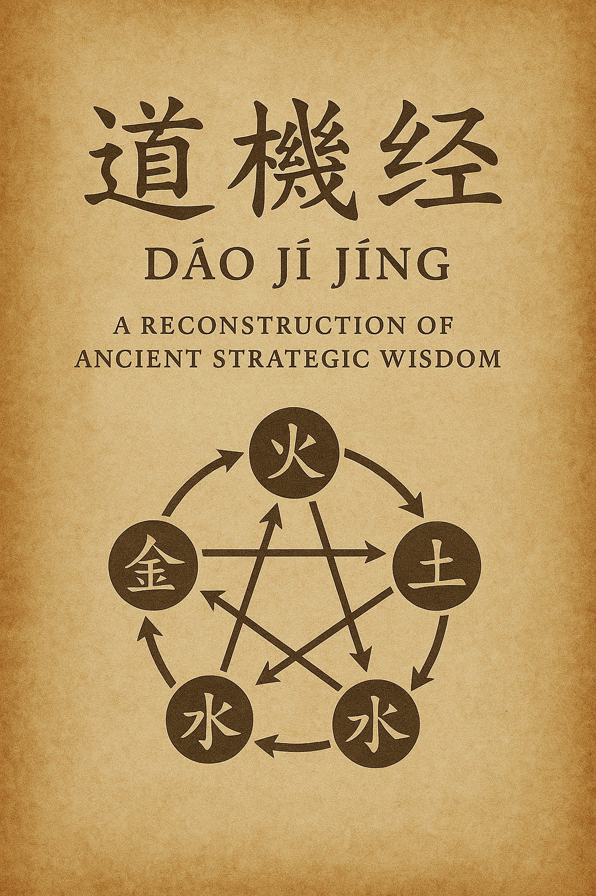

## 道機經 - The Dao Ji Jing
### A Reconstruction of Ancient Strategic Wisdom



---

## 📜 About This Text

The **Dao Ji Jing** (道機經) - "Scripture of the Dao's Mechanism" - represents a reconstruction of an ancient Chinese strategic text that was lost to history. Unlike the famous *Dao De Jing* which focuses on virtue and non-action, the *Dao Ji Jing* reveals the precise mechanisms through which the Dao operates in strategic affairs.

This work explores the **Five Mechanisms** (五機) corresponding to the Five Elements:
- **金機 (Metal)** - The mechanism of discernment and clarity
- **木機 (Wood)** - The mechanism of growth and development  
- **水機 (Water)** - The mechanism of adaptation and flow
- **火機 (Fire)** - The mechanism of transformation and breakthrough
- **土機 (Earth)** - The mechanism of integration and stability

---

## 🎯 What You'll Find Here

### Strategic Wisdom for Modern Times
This ancient framework provides practical guidance for:
- **Leadership & Decision-Making** - Clear discernment and balanced judgment
- **Innovation & Growth** - Sustainable development and breakthrough thinking
- **Adaptation & Change** - Flowing with circumstances while maintaining direction
- **Transformation & Renewal** - Creating change without destructive force
- **Integration & Harmony** - Unifying diverse elements into coherent wholes

### Complete Five-Volume Structure
Each volume corresponds to one elemental mechanism:

**Volume 1: 金機篇 (Metal Mechanism)**
- Invisible Positioning
- Application of Metal Nature
- Discerning Form and Momentum
- The Way of Hardness and Softness
- Discernment Without Obstruction

**Volume 2: 木機篇 (Wood Mechanism)**
- The Way of Generation and Development
- Application of Wood Nature
- Growing According to Momentum
- Breaking Through Constraints
- Generation Without Limit

**Volume 3: 水機篇 (Water Mechanism)**
- The Science of Timing
- Application of Water Nature
- Responsive Change and Flowing Through
- Unobstructed Integration
- Adaptation Without Hindrance

**Volume 4: 火機篇 (Fire Mechanism)**
- The Way of Transformation
- Application of Fire Nature
- Breaking Through Boundaries
- The Art of Illumination
- Transformation Without Fixity

**Volume 5: 土機篇 (Earth Mechanism)**
- Position-Timing Unity
- Application of Earth Nature
- Great Completion Seems Incomplete
- Centered Uprightness and Peace
- The Unity of the Five Mechanisms

---

## 🌟 Key Concepts

### The Five Mechanisms (五機)
Each mechanism represents both a strategic approach and a way of being:

```
金 (Metal) → Clarity, Discernment, Decisive Action
木 (Wood) → Growth, Development, Organic Expansion  
水 (Water) → Adaptation, Flow, Perfect Timing
火 (Fire) → Transformation, Innovation, Breakthrough
土 (Earth) → Integration, Stability, Comprehensive Unity
```

### Strategic Principles
- **Position-Timing Unity** (位時合一) - Aligning the right place with the right moment
- **Mechanism Awareness** (機之覺知) - Recognizing leverage points where small actions create large effects
- **Five-Fold Harmony** (五機合一) - Integrating all mechanisms into unified strategic wisdom

---

## 🤝 Contributing

This is a living document that benefits from community engagement:

- **Translations** - Help translate key passages or create versions in other languages
- **Applications** - Share how you've applied these principles in modern contexts
- **Commentary** - Provide insights from your study and practice
- **Corrections** - Point out any errors or suggest improvements

---

## 📚 Background

### Historical Context
According to records by Ge Hong (葛洪), the original *Dao Ji Jing* was attributed to Jun Xi (君喜) and consisted of five volumes corresponding to the Five Elements. While the complete text was lost over the centuries, fragments and transmissions preserved its essential wisdom.

### Reconstruction Method
This reconstruction draws from:
- Classical Chinese strategic texts
- Daoist philosophical principles
- Five Element theory and applications
- Traditional Chinese strategic thinking
- Modern systems theory and complexity science
