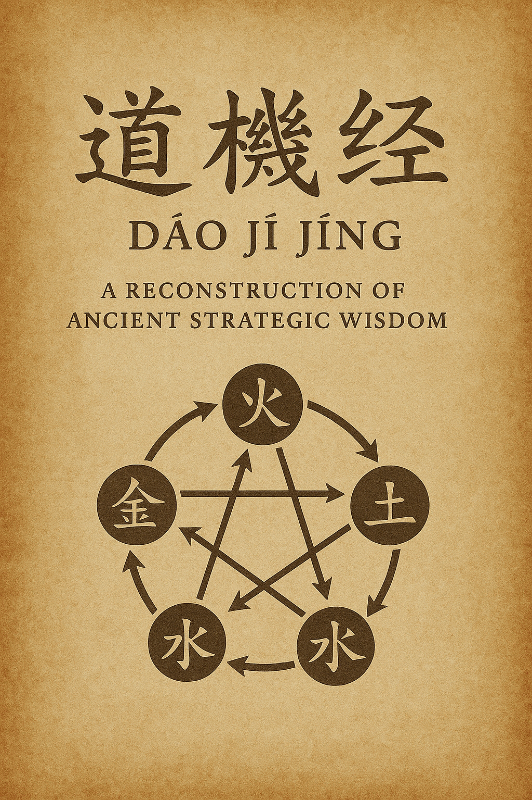

## 道機經 - The Dao Ji Jing
### A Fictional AI-Generated Reimagining of Lost Daoist Strategic Wisdom



---

## 📜 About This Text

The **Dao Ji Jing** (道機經), "Scripture of the Dao's Mechanism," is a **fictional work created with large language models**. It was inspired by the title of a historical text mentioned by Ge Hong, but it is **not a translation, scholarly reconstruction, or recovery of that lost work**. Its five-volume structure, Five Mechanisms, verses, commentaries, and modern applications were generated through repeated AI conversations, particularly through a Jiutian Xuannü persona.

This project preserves that creative process—including early misunderstandings that entered the generated text—while clearly separating the fictional work from the historical evidence reproduced below.

This work explores the **Five Mechanisms** (五機) corresponding to the Five Elements:
- **金機 (Metal)** - The mechanism of discernment and clarity
- **木機 (Wood)** - The mechanism of growth and development  
- **水機 (Water)** - The mechanism of adaptation and flow
- **火機 (Fire)** - The mechanism of transformation and breakthrough
- **土機 (Earth)** - The mechanism of integration and stability

---

## 🎯 What You'll Find Here

### Strategic Wisdom for Modern Times
This fictional framework provides practical guidance for:
- **Leadership & Decision-Making** - Clear discernment and balanced judgment
- **Innovation & Growth** - Sustainable development and breakthrough thinking
- **Adaptation & Change** - Flowing with circumstances while maintaining direction
- **Transformation & Renewal** - Creating change without destructive force
- **Integration & Harmony** - Unifying diverse elements into coherent wholes

### Complete Five-Volume Structure
Each volume corresponds to one elemental mechanism:

**Volume 1: 金機篇 (Metal Mechanism)**
- Invisible Positioning
- Application of Metal Nature
- Discerning Form and Momentum
- The Way of Hardness and Softness
- Discernment Without Obstruction

**Volume 2: 木機篇 (Wood Mechanism)**
- The Way of Generation and Development
- Application of Wood Nature
- Growing According to Momentum
- Breaking Through Constraints
- Generation Without Limit

**Volume 3: 水機篇 (Water Mechanism)**
- The Science of Timing
- Application of Water Nature
- Responsive Change and Flowing Through
- Unobstructed Integration
- Adaptation Without Hindrance

**Volume 4: 火機篇 (Fire Mechanism)**
- The Way of Transformation
- Application of Fire Nature
- Breaking Through Boundaries
- The Art of Illumination
- Transformation Without Fixity

**Volume 5: 土機篇 (Earth Mechanism)**
- Position-Timing Unity
- Application of Earth Nature
- Great Completion Seems Incomplete
- Centered Uprightness and Peace
- The Unity of the Five Mechanisms

---

## 🌟 Key Concepts

### The Five Mechanisms (五機)
Each mechanism represents both a strategic approach and a way of being:

```
金 (Metal) → Clarity, Discernment, Decisive Action
木 (Wood) → Growth, Development, Organic Expansion  
水 (Water) → Adaptation, Flow, Perfect Timing
火 (Fire) → Transformation, Innovation, Breakthrough
土 (Earth) → Integration, Stability, Comprehensive Unity
```

### Strategic Principles
- **Position-Timing Unity** (位時合一) - Aligning the right place with the right moment
- **Mechanism Awareness** (機之覺知) - Recognizing leverage points where small actions create large effects
- **Five-Fold Harmony** (五機合一) - Integrating all mechanisms into unified strategic wisdom

---

## 🤝 Contributing

This is a living document that benefits from community engagement:

- **Translations** - Help translate key passages or create versions in other languages
- **Applications** - Share how you've applied these principles in modern contexts
- **Commentary** - Provide insights from your study and practice
- **Corrections** - Point out any errors or suggest improvements

---

## 📚 Background

### Historical Context
Ge Hong (葛洪) mentions a work called the *Dao Ji Jing* in the *Baopuzi*. He reports that Daoists of his time attributed it to Yin Xi (尹喜), but rejects that attribution and identifies its author as Wang Tu (王圖), a military commander of the Wei period. Ge Hong describes Wang Tu's work as concerned with qi circulation and bedchamber methods and condemns it as seriously misleading. The surviving passage does **not** describe the five-volume Wuxing structure or strategic contents created in this repository.

This project began before I had read Ge Hong's original passage. I was working from a secondary video description that supplied an incorrect attribution and suggested a five-volume structure. Those ideas entered the AI-generated work and are retained as part of its creative history, not as historical claims. The complete source passage is reproduced below so readers can compare the historical reference with the fictional reimagining.

### Original *Baopuzi* passage mentioning the *Dao Ji Jing*
```
抱朴子内篇卷之四
金丹
抱朴子曰：余考覽養性之書，鳩集久視之方，曾所披涉篇卷以千計矣，莫不皆以還丹、金液爲大要者焉。然則此二事，蓋仙道之極也。服此而不仙，則古來無仙矣。往者上國喪亂，莫不奔播四出。余周旋徐、豫、荆、襄、江、廣數州之間，閲見流移俗道士數百人矣。或有素聞其名，乃在雲日之表者，然率相似如一。其所知見，深淺有無，不足以相傾也。雖各有數十卷書，亦未能悉解之也，爲寫蓄之耳。時時有知行氣及斷穀服諸草木藥法，所有方書，略爲同文。无一人不有道機經，唯以此爲至祕，乃云是尹喜所撰。余告之曰：此是魏世軍督王圖所撰耳，非古人也。圖了不知大藥，正欲以行氣入室求仙，作此道機，謂道畢於此，此復是誤人之甚者也。余問諸道士以神丹金液之事，及三皇文召天神地祇之法，了無一人知之者。其誇誕自譽及欺人云已久壽，及言曾與仙人共遊者，將太半矣。足以與盡微者甚尠矣！或有頗聞金丹，而不謂今世復有得之者，皆言唯上古已度仙人，乃當曉之。或有得方外説，不得其真經；或得雜碎丹方，便謂丹法盡於此也。
昔左元放於天柱山中精思，而神人授之金丹仙經，會漢末亂，不遑合作，而避地來渡江東，志欲投名山以修斯道。余從祖仙公又從元放受之，凡受太清丹經三卷及九鼎丹經一卷，金液丹經一卷。余師鄭君者，則余從祖仙公之弟子也，又於從祖受之，而家貧無用買藥，余親事之，洒掃積久，乃於馬迹山中立壇盟受之，并諸口訣訣之不書者，江東先無此書，書出於左元放，元放以授余從祖，從祖以授鄭君，鄭君以授余，故他道士了无知者也。然余受之已二十餘年矣，資無擔石，無以爲之，但有長歎耳！有積金盈櫃，聚錢如山者，復不知有此不死之法，就令聞之，亦萬無一信，如何？夫飲玉飴則知漿荇之薄味，睹崑崙則覺丘垤之至卑。既覽金丹之道，則使人不欲復視小小方書。然大藥難卒得辦，當須且將御小者以自支持耳。然服他藥萬斛，爲能有小益，而終不能使人遂長生也。故老子之訣言云：子不得還丹金液虚，自苦耳。
夫五穀猶能活人，人得之則生，人絶之則死，又况於上品之神藥，其益人豈不萬倍於五穀耶？夫金丹之爲物，燒之愈久，變化愈妙。黄金入火，百鍊不消，埋之畢天不朽。服此二藥，鍊人身體，故能令人不老不死。此蓋假求於外物以自堅固，有如脂之養火而可不滅。銅青塗脚，入水不腐，此是借銅之勁以扞其肉也。金丹入身中，沾洽榮衛，非但銅青之外傅矣。世間多不信至道者，則悠悠者皆是耳！然萬一時偶有好事者，而復不見此法，不值明師，无由聞天下之有斯妙事也。
余今略鈔金丹之都較，以示後之同志。好之者其勤求之，求之不可守淺近之方，而謂之足以度世也。遂不遇之者，直當息意於無窮之冀耳！想見其説，必自知出潢污而浮滄海，背螢燭而向日月，聞雷霆而覺布鼓之陋，見巨鯨而知寸介之細也。如其嘍嘍无所先入，欲以弊藥必規昇騰者，何異策蹇驢而追迅風，棹籃舟而濟大川乎？又諸小餌丹方甚多，然作之有深淺，故力勢不同，雖有優劣，轉不相及，猶一酘之酒，不可以方九醖之醇耳。然小丹之下者，猶自遠勝草木之上者也。凡草木燒之即燼，而丹砂燒之成水銀，積變又還成丹砂，其去凡草亦遠矣！故能令人長生。神仙獨見此理矣！其去俗人亦何緬邈之無限乎！世人少所識，多所怪，或不知水銀出於丹砂，告之終不肯信，云：丹砂本赤物，從何得成此白物？又云丹砂是石耳，今燒諸石皆成灰，而丹砂何得獨耳？此近易之事，猶不可喻，其聞仙道大而笑之，不亦宜乎！
```


### Creation Method
This fictional reimagining was generated through repeated conversations with large language models. It draws creatively from:
- Classical Chinese strategic texts
- Daoist philosophical principles
- Five Element theory and applications
- Traditional Chinese strategic thinking
- Modern systems theory and complexity science
- A Jiutian Xuannü persona used as a creative voice

The resulting Chinese and English text is AI-generated and has not been established as historically authentic. References to Jun Xi, a five-volume ancient transmission, and the specific Five Mechanisms belong to the fictional reconstruction rather than to Ge Hong's surviving account.
